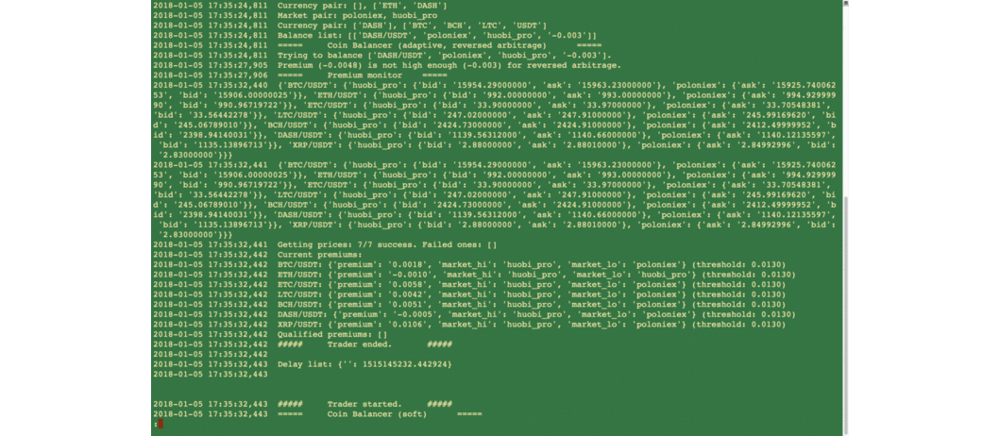

Automatic Arbitrage Trader for Cryptocurrencies in Global Exchanges

This repo is a sample code of an automatic arbitrage trader for cryptocurrencies (Bitcoin, Ethereum, Litecoin, etc.) in global exchanges. It is a legacy version in mid 2017.

The newest version uses a unified client in ccxt. 

Structure of the project:

    +------------------------------------+
    |         arbitrage_manager          |
    +------------------------------------+
    |  arbitrage_trader  coin_balancer   |
    +------------------------------------+
    |                aux                 |
    +------------------------------------+
    |          unified_clients           |
    +------------------------------------+
    |                ccxt                |
    +------------------------------------+

    logs:   store all logs and records
    config: store all config parameters
    readme: this file
    update: store all update logs

This trader monitors the prices of cryptocurrencies in global exchanges in a high frequency and calculates the premiums and executes arbitrage trades. Use multiprocessing/asyncio to fetch price book cuncurrently and to execute the trades quickly. It moves coins within different exchanges automatically to balance the balances. It sends notifications to user when an order is successfully traded/exception occurs, makes records of all executed trades and keeps logs. It's able to handle various exchanges and markets (a.k.a. currency pairs) and easy to extend.

The newest version uses updated techniques to adapt to more exchanges and markets, better maintainability and extendability, avoid physically moving the coins. 

虚拟货币自动化套利交易程序

自动监控全球交易所虚拟货币（比特币、以太坊、莱特币等）价格，计算溢价，执行套利交易，自动平衡各交易所余额，自动发送成交报告、记录成交明细和系统日志。新版本使用统一的交易所接口，更新程序架构，更容易扩展、维护，并使用新方法绕过转账，智能平衡各交易所余额。

当前展示的代码是2017年中开发的老版本，仅供参考。
